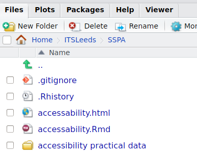

```{r setup, include=FALSE}
knitr::opts_chunk$set(echo = TRUE)
```

Welcome to R for accessibility analysis.

# Prerequisites 

Building on the previous R notes, we will start by loading and visualising the data.
Start by loading the packages we'll use for this exercise, **sf** and the slower but more mature and feature-complete **sp**. For the following commmands to work the packages must be installed on your computer (see notes from last for infor on how to do that).

```{r}
library(sp)
library(sf)
```

Another pre-requisite is that the schools data is saved in your working directory.
Unzip the file `accessibility practical data.zip` into the folder you're working from, and check it has worked.
If your project is called SSPA, for example, you should the following in the file explorer panel:



# Preliminary analysis of data

```{r, message=FALSE}
school_file = "accessibility practical data/HGTJTSSecondary_School.csv"
school_data = read.csv(school_file)
```

We can explore the data loaded. Use the following commands to see what information we have about school accessibility, in terms of the number of rows, column names and summary statistics for assorted variables:

```{r}
nrow(school_data)
names(school_data)
summary(school_data$Region)
summary(school_data$LA_Name)
summary(school_data$SSCyct)
```

The results tell us some very useful things about this dataset: all the records are in the same city (Harrogate again) and there is a wide variability in the time it takes to get to school by bicycle. Refer back to the data in `accessibility practical data/jts0503.xls` to see what the column names mean.

We can visualise the distribution of average times taken to get to school per zone with a histogram:

```{r}
hist(school_data$SSCyct)
```

## Exercises 

1. What does the histogram tell you about the spatial distribution of schools in Harrogate?
1. What's the average time taken to get to school by public transport and car?
1. What's the average percent of users in Harrogate who can get to school in 30 minutes, by public transport, car and cycling?
1. What's the average percent of users in Harrogate who **cannot** get to school in 30 minutes, by public transport, car and cycling? (Bonus: what is surprising about this, why, and what explains it?)
1. How many zones are there in which the majority of children could not cycle to school in 15?

# Joining the spatial and non-spatial data


# Code that may help if you get stuck (not necessarily in order)

## Challenges

1. Type out each line of code and see if you can reproduce the results.
1. Add comments with the `#` above each line to explain what is going on.

```{r, eval=FALSE}

sum(school_data$SSCyc15pct < 50)
library(dplyr)
res = group_by(school_data, LA_Name) %>% 
  select(contains("30pct")) %>% 
  summarise_if(is.numeric, mean)
res
100 - res
mean(school_data$SSCart)
mean(school_data$SSPTt)
```

<!-- # A tibble: 1 × 4 -->
<!--     LA_Name SSPT30pct SSCyc30pct SSCar30pct -->
<!--      <fctr>     <dbl>      <dbl>      <dbl> -->
<!-- 1 Harrogate  69.76923   82.42308        100 -->


