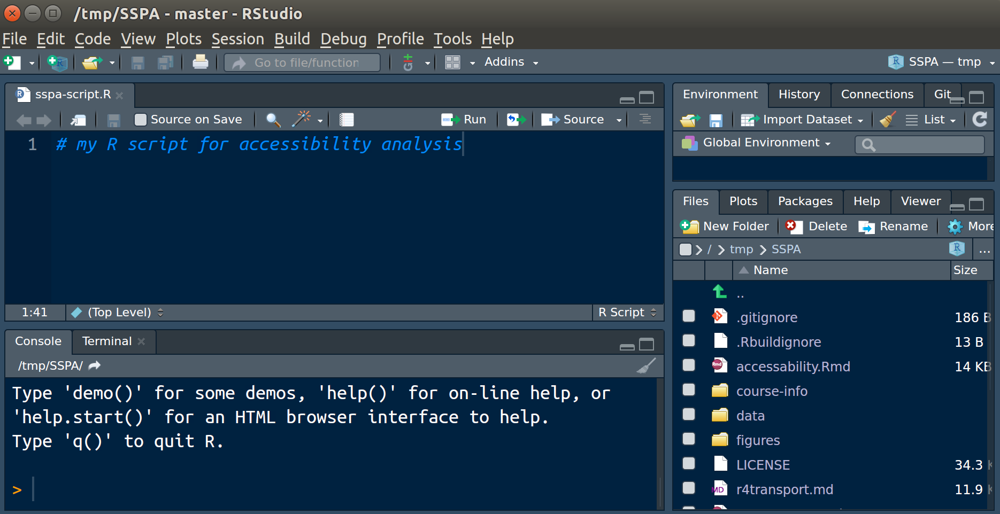

```{r setup, include=FALSE}
knitr::opts_chunk$set(echo = TRUE, fig.align = "center")
```

Welcome to R for accessibility analysis.

# Prerequisites 


It is assumed you have a basic understanding of R and spatial data, which can be obtained by following an online tutorial such as that provided by the 'Free Introduction to R' course by [DataCamp](https://www.datacamp.com/courses/free-introduction-to-r), Chapter 2 and Chapter 3 of the online book [R for Data Science](r4ds.had.co.nz/) @grolemund_r_2016-1.

In addition, to gain an understanding of geographic data in R, I recommend following [Chapter 2](https://geocompr.robinlovelace.net/spatial-class.html) of the online book [Geocomputation with R](https://geocompr.robinlovelace.net/) [@lovelace_geocomputation_2018].

The main tutorial is [accessibility](https://github.com/ITSLeeds/SSPA/blob/master/accessability.Rmd), which is best followed as a print-out.
Before starting, you should check you have all the necessary files in the 'working directory' of your R project.
These can be downloaded from from: [github.com/ITSLeeds/SSPA/archive/master.zip](https://github.com/ITSLeeds/SSPA/archive/master.zip). Unzip the folder and open the file `SSPA.Rproj` with RStudio.
To check this has worked, look in the top-right panel of RStudio.
You should see the project name in the top right of RStudio, as illustrated in Figure \@ref(fig:rstudio).

```{r rstudio, fig.cap="RStudio with the SSPA project open. Note the files in the bottom right panel.", echo=FALSE, out.width="90%"}

```

**Ask for help if you cannot see this.**

In addition, the data in `accessibility practical data` and `QGISforSSPAdata` can be downloaded as .zip files in the 'releases' section of [github.com/ITSLeeds/SSPA](https://github.com/ITSLeeds/SSPA/releases).
The data we will use should go **in the same SSPA-master** folder: that will ensure the `schools` data is saved in your working directory.
Unzip the file `accessibility practical data.zip` into the folder you're working from, and check it has worked.
When you've loaded the project correctly, with the files unzipped in it, your RStudio session should look similar to that illustrated in Figure \@ref(fig:rstudio).

**Ask for help if you cannot see these files**

You can check the working directory you are in with `getwd()`:

```{r}
getwd()
```

You can double check you have all the files you need by entering this command:

```{r}
list.files()
```

Building on the previous R notes, we will start by loading and visualising the data.
Start by loading the packages we'll use for this exercise, **sf**. For the following commands to work the packages must be installed on your computer.
This can be done using the function `install.packages("packagename")` as follows:

```{r, eval=FALSE}
install.packages("sf")
install.packages("tidyverse")
install.packages("tmap")
```

You will load the packages using the `library()` function:

```{r}
library(sf)
```

```{r, message=FALSE}
library(tidyverse)
library(tmap)
```

# Preliminary analysis of data

The first thing to do is read-in a table of data:

```{r, message=FALSE}
school_file = "accessibility practical data/HGTJTSSecondary_School.csv"
school_data = read.csv(school_file)
```

We can explore the data loaded using a range of R commands. The following commands to see what information we have about school accessibility, in terms of the number of rows, column names and summary statistics for assorted variables:

```{r}
nrow(school_data)
names(school_data)
summary(school_data$Region)
summary(school_data$LA_Name)
summary(school_data$SSCyct)
```

The results tell us some very useful things about this dataset: all the records are in the same city (Harrogate again) and there is a wide variability in the time it takes to get to school by bicycle. Refer back to the data in `accessibility practical data/jts0503.xls` to see what the column names mean.

```{r}
variable_names = readxl::read_excel("accessibility practical data/jts0503.xls", skip = 9)
variable_names
```


We can visualise the distribution of average times taken to get to school per zone with a histogram:

```{r}
hist(school_data$SSCyct)
```

Further, R makes exploring the relationships between variables relatively easy.
The following command, for example, reports the correlation between the time taken by car and by bike to get to school across the zones in Harrogate:

```{r}
cor(school_data$SSCart, school_data$SSCyct)
```

Use the command `?cor` to find out what the output means: that the Pearson coeficient of determination is very close to 1, meaning that there is a strong positive relationship between the time taken to get to school by car and bike.

This can be plotted with the base `plot()` function:

```{r}
plot(school_data$SSCart, school_data$SSCyct)
```

This raises the question: what is the relationship between time to get to school by car and public transport?

Before moving on to try the exercises, try to play with the data. Can you find out any surprising statistics, or interesting visualisations?

## Tip

Use the command `View(school_data)` to see the data in an interactive spreadsheet.

## Exercises 

1. What does the histogram plotted above tell you about the spatial distribution of schools in Harrogate?
1. What's the average time taken to get to school by public transport and car?
1. What's the average percentage of users in Harrogate who can get to school in 30 minutes, by public transport, car and cycling?
1. What's the average percentage of users in Harrogate who **cannot** get to school in 30 minutes, by public transport, car and cycling? (Bonus: what is surprising about this, why, and what explains it?)
1. How many zones are there in which the majority of children could not cycle to school in 15?

# Loading and exploring the spatial data

From the previous section we should have a good idea about what the data is like. From the exercises and generally playing with the data, it should be clear that there are many more things we could do to explore this dataset. R excels at statistical analysis. It allows you 'shred' datasets or 'make data sing', depending how you like to say it. So time spent learning data processing and visualisation with R is time well spent.

Putting the data on a map is a particularly powerful method for understanding it.
Geographical analysis can help develop locally specific sustainable transport policies. To do that, we need join the data in `school_data` with a spatial dataset we'll read-in from a shapefile.

Read in the data as follows:

```{r}
zones_file = "accessibility practical data/HGT_JTS_SecondarySchShape/HGT_JTS_SecondarySchShape.shp"
zones = st_read(zones_file)
```

Next, we will execute some commands to explore this data:

```{r, out.width="50%", fig.cap="Illustration of basic plot with R"}
names(zones)
plot(zones[1])
summary(zones[3:10])
```

The output tells that there are a load of confusingly named columns (as is unfortunately so common with official data!). They are clearly of Harrogate, as we plotted in the last R practical. And, beyond the variable `HGTJTSSe_5`, the mean values of the `HGTJTSSe` variables seem to increase steadily. 

We can get more of an indication of what is going on by plotting the numeric variables. Let's try plotting variables from 6 to 10:

```{r, out.width="50%", fig.cap="Illustration of facet plotting with the `plot` command."}
plot(zones[6:10])
```

The results have a clear spatial pattern. The high values all seem to be near the centre. They grow outward with each increase in the variable number. We can verify that the high values are yellow by plotting the high ones over the top of the overall map in a certain colour:

```{r, out.width="50%", fig.cap="Overlay of zones with "}
plot(zones[10])
plot(zones[zones$HGTJTSSe_8 > 6, 10], add = T, col = "black")
```

This suggests that areas in the North of Harrogate are better from an accessibility perspective.

In addition to these static maps, R can also create interactive maps of the type generated by QGIS using add-on visualisation packages such as tmap, as illustrated below:

```{r, fig.cap="Interctive map of zones in RStudio.", out.width="75%"}
library(tmap)
tmap_mode("view") # switch to interactive plotting mode
qtm(zones)
```

For more information on mapping with R see [Chapter 9](http://geocompr.robinlovelace.net/adv-map.html) of Geocomputation with R.

## Exercises

1. At the outset of the section it was stated that learning R is a good investment of time. Find and write down then names of 3 resources for learning R from the internet. Which is your favourite and why?  
1. What is the maximum value of the variables? What do they refer to?

# Joining the spatial and non-spatial data

Often you will not be provided with 'attribute data' alongside your spatial data.
Therefore it is useful to be able to 'join' non-spatial attribute data to spatial features, such as the `zones` object.

You can do this based on matching variables, which we should be able to guess based on the previous analysis. Let's just verify that, by looking at the first few:

```{r}
head(school_data$LSOA_code)
head(zones$LSOA11C)
```

The results show that the LSOA codes seem to align. 
We can test if they are equal using the `identical()` function:

```{r}
identical(school_data$LSOA_code, zones$LSOA11C)
summary(school_data$LSOA_code == zones$LSOA11C) # another check
```

In this case, where the values and order of the geographical and attribute data are the same, we can simply 'bind' the non-geographical variables onto the geographical data, as follows:

```{r, out.width="50%"}
zones_joined = st_bind_cols(zones, school_data)
plot(zones_joined["SSCyct"])
```

The results show, as we may have imagined, that the most accessible places for cycling (with the lowest average cycle times) are located near the city centre.

As an exercise, imagine that your schools data is not in the correct order.
We can create this 'mixed up' dataset by sampling randomly from the rows:

```{r}
set.seed(42) # so random numbers repeat, for reproducibility
new_order = sample(nrow(school_data))
school_data_mixed = school_data[new_order,]
```

Now simply joining the data results in incorrect data, as illustrated below.

```{r, out.width="50%"}
zones_mixed = st_bind_cols(zones, school_data_mixed)
plot(zones_mixed["SSCyct"])
```

The results show no meaningful pattern. They have been 'scrambled'.
**This is common problem with spatial data - watch out!**

To 'descramble' the data, we can use the `inner_join()` function from the **dplyr** package. Before the data can be joined, we must ensure the 'joining variable' has the same name in both datasets:

```{r, out.width="50%"}
library(dplyr)
names(school_data_mixed)[1] # recall name of LSOA variable
names(zones)[1]
school_data_mixed = rename(school_data_mixed, LSOA11C = LSOA_code)
```

We're going to use the `left_join()` function from **dplyr** because it does keeps the number of rows the same before and after the join:

```{r, out.width="50%"}
zones_descrambled = left_join(x = zones, y = school_data_mixed)
plot(zones_descrambled["SSCyct"])
```

If you get the same plot as I did, well done: you've just performed an attribute join on a spatial dataset from the command line using cutting edge software for spatial data science. Congratulations!

# Generating your own measure of accessibility

It's great that the UK has accessibility data at such high geographical resolution, but in many situations, you'll have to develop your own metrics of accessibility.
In this section we will therefore see if we can generate our own metric of accessibility, to complement the official stats.

## Downloading and processing data from OSM

Let's download the schools in Harrogate as a starting point.
I did using code from the in-development **osmdata** package, which I've commented out to reduce time and complexity.

```{r}
# Code to download schools data - uncomment if you're brave!
# install.packages("osmdata")
# library(osmdata)
# q = add_feature(opq(bbox = "Harrogate"), "amenity", "school")
# schools_osm = osmdata_sf(q)
# plot(zones[15])
# schools_osm_p = schools_osm$osm_points
# st_write(schools_osm_p, "data/schools.geojson") # save the results
```

Now we can load-in and plot the data:

```{r, out.width="50%"}
schools = st_read("data/schools.geojson")
plot(zones[15])
plot(schools, add = T)
```

But where are the schools? What just happened??

The answer to this question lies in the CRS, which we can double check as follows:

```{r}
st_crs(zones)
st_crs(schools)
```

The output of those commands shows that they are totally different. The solution: transform the pesky schools so they have the same CRS:

```{r, out.width="50%"}
schools = st_transform(schools, st_crs(zones))
plot(zones[15])
plot(schools, add = T)
```

Now it works.

The only problem is that there are reported to be dozens of schools dotted all round Harrogate. There cannot be that many!

One way to subset only the points that actually are schools is to remove all those that have no name:

```{r, out.width="50%"}
sel_noname = is.na(schools$name)
schools = schools[!sel_noname,]
plot(zones[15])
plot(schools, add = T, cex = 5, pch = 20, col = "red")
```

How far are those schools from the zones?
That can be calculated in R too (as with most things):

```{r}
dist_mat = st_distance(zones, schools)
dist_min = apply(dist_mat, MARGIN = 1, FUN = min)
zones_joined$dist_to_school = dist_min
plot(zones_joined["dist_to_school"])
plot(schools, add = T, cex = 5, pch = 20, col = "red")
```

Well done, you've created your first (albeit crude) accessibility indicator.
How does it compare with the official data?
Let's take a look:

```{r}
plot(zones_joined$dist_to_school, zones_joined$SSCyct)
```

That may not seem like an impressive fit, but `cor()` proves that there is a good positive correlation:

```{r}
cor(zones_joined$dist_to_school, zones_joined$SSCyct)
```

The final exercise is to create a model linking distance to school from our OSM data with the time to cycle from official data:

```{r}
model_cycle = lm(formula = SSCyct ~ dist_to_school, data = zones_joined)
cy_pred = model_cycle$fitted.values
plot(zones_joined$dist_to_school, zones_joined$SSCyct)
lines(zones_joined$dist_to_school, model_cycle$fitted.values)
```

## Challenges

1. Try to fit more variables to explain the variability in `SSCyct` - which are most powerful?
1. Take a look at the **osmdata** package on-line. What can you find out about it?
1. How could OSM data be useful in transport research?

**Advanced Challenge**

1. Access data from the Propensity to Cycle Tool ([pct.bike](http://www.pct.bike/)), an online system for sustainable transport planning [@lovelace_propensity_2017]. Download data for Harrogate and find travel times by bike to Harrogate city centre for each LSOA.

# Code that may help if you get stuck (not necessarily in order)

```{r, eval=FALSE}

sum(school_data$SSCyc15pct < 50)
library(dplyr)
res = group_by(school_data, LA_Name) %>% 
  select(contains("30pct")) %>% 
  summarise_if(is.numeric, mean)
res
100 - res
mean(school_data$SSCart)
mean(school_data$SSPTt)
summary(zones)
```

<!-- # A tibble: 1 × 4 -->
<!--     LA_Name SSPT30pct SSCyc30pct SSCar30pct -->
<!--      <fctr>     <dbl>      <dbl>      <dbl> -->
<!-- 1 Harrogate  69.76923   82.42308        100 -->

## Challenges

1. Type out each line of code and see if you can reproduce the results.
1. Add comments with the `#` above each line to explain what is going on.
1. **Advanced challange:** Take a look at the academic paper [@moreno-monroy_public_2017] and critically assess the accessibility methods used

# References and further resources

## Further resources

- Basic: Chapter 2 of [Geocomputation with R](https://geocompr.robinlovelace.net/spatial-class.html)
- Intermediate: Chapter 7 of [Geocomputation with R](http://geocompr.robinlovelace.net/transport.html) on Geocomputation for Transport
- Intermediate: all other chapters from Geocomputation with R
- Advanced: [`vignette(package = "sf")`](https://cran.r-project.org/web/packages/sf/vignettes/)

## References

