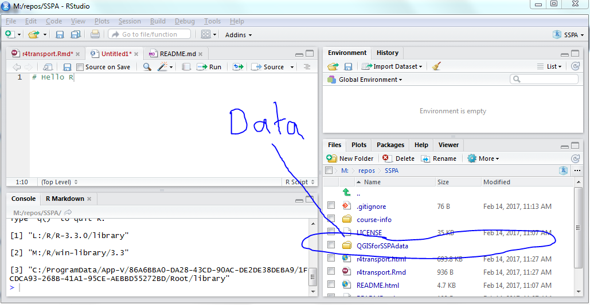

```{r setup, include=FALSE}
knitr::opts_chunk$set(echo = TRUE)
```

# Introduction

## Context: Sustainable Spatial Planning and Analysis

- Reproducibility requires operations to be encoded in computer code
- That is why a command line interface (CLI) is so powerful
- Solutions are more sustainable if they can be reproduced

Requirements: students are recommended to have the latest versions of R, RStudio and QGIS installed on their computers.

Learning outcomes: students will learn how to download and visualise spatial data with R

We'll build on the datasets used in the previous practical.

## Setting up a project

Open RStudio and click on the box in the top right hand corner.
Create a new project and call it something sensible, like `SSPA-R`.

You can also download the contents of the project `SSPA` that these materials were developed in, from:

https://github.com/ITSLeeds/SSPA/archive/master.zip

Get used to RStudio's interface, with reference to the '[RStudio Cheatsheet](https://www.rstudio.com/wp-content/uploads/2016/01/rstudio-IDE-cheatsheet.pdf)' (Google it if you cannot find it!).

## Getting up to speed with R

Based on Colin Gillespie's Introduction to R, try: 

- Creating and deleting objects
- Basic plotting
- Creating and saving R scripts

Before continuing

## R version, installing and updating packages

To check what version of R you're using, type the following command.

# Reproducing what we did with QGIS

## Data access

First, we must ensure that the data used for the QGIS tutorial is in your working directory.

You could just look at the Files tab in the bottom left of your RStudio instance to do this:


```{r, echo=FALSE}

```

You can also do the programmatically, but entering the following command:

```{r}
list.dirs(recursive = FALSE)
```

What just happened?

We asked R to list all the directories in the working directory. Note that the output is printed to screen, and into this tutorial. The one we're interested in is element number 5:

```
[5] "./QGISforSSPAdata
```

This exercise demonstrates the difference between a graphical user interface and doing things programmatically. Both work. But the programming way is more precise, but potentially more confusing if you're new to R.

### Challenge

1. Look inside the QGISforSSPAdata folder. Count how many files and folders are in there manually.

2. Now automate the process using the function `list.files()` - what is the output? Do the numbers match?

Note: this is the output you should get from the previous command:

```{r, echo=FALSE}
list.files(path = "QGISforSSPAdata/")
```

## Reading data

We'll use the **sf** package to read the data.

To install the package, use the following command:

```{r, eval=FALSE}
install.packages("sf")
```

To make the functions available from the package we've just installed, use the `library` function, as follows:

```{r}
library(sf)
```

Now we can use the new powers enabled by this package, like reading in a shapefile:

```{r}
stns = st_read("QGISforSSPAdata/stations UK/station_point.shp")
```

Note that the information printed to screen when you read this file in is useful. It tells you the data format (ESRI Shapefile), the number of features (2,525 output areas) and the coordinate reference system (CRS): the `+units=m` part of the output tells you that units of this CRS is meters.

Now that the data has been loaded into an R object, `stns`, we can query and analyse the data.
To provide a simple example, find out the names of the variables in the object, using the `names()` function as follows:

```{r}
names(stns)
```

The result tells us that there are 4 variables stored in the object (one of these, `geometry` is not really a data attribute but a geographical attribute so the data has 3 variables or `fields`).

The data can be plotted as follows:

```{r}
plot(stns)
```

Note that three versions of the dataset are plotted: one for each variable contained in the `stns` object.
These can be seen with the following command:

```{r}
head(stns)
```

### Challenge: read and plot Harrogate data

1. Find the file Harrogate OAC layer on your computer and load it into an object called `harrogate_oac` using the function `st_read()`.

```{r, echo=FALSE, results='hide'}
harrogate_oac = st_read("QGISforSSPAdata/Harrogate OAC/Harrogate.shp")
```

2. Explore the results using the `names()`, `plot()`, and `head()` commands. How many variables does the object `harrogate_aoc` have? The results of the first of these commands is shown below. **Note: if you plot the object, make sure you only plot a few of the variables, e.g. those represented by `harrogate[1:3]`.

```{r, echo=FALSE}
names(harrogate_oac)
```

## Subsetting data

This section assumes you have an object called `harrogate_aoc` loaded into your R environment.
As with the location of files, you can check this in two ways, using either the GUI or the CLI. (Quicktest: what is a GUI? What is a CLI?)

The GUI method involves clicking on the right part of the screen if the Environment pane isn't already visible in the top left of your RStudio console. The CLI method uses the `ls()` (short for list objects) function as follows:

```{r}
ls()
```

### Subsetting based on attribute

Now we've establised that the `harrogate_aoc` data is definitely there, we can sub-set it as follows:

```{r}
h_sel = harrogate_oac[harrogate_oac$SPRGRP == 1,]
```

Let's see what we've subsetted but plotting the result for the relevant variable:

```{r}
plot(h_sel["SPRGRP"])
```

What just happened? The subsetting command used the square brackets (`[]`) to select only the features of interest and then we plotted the result for a single variable.

That may seem complicated and confusing, but it's actually a highly efficient way of subsetting geographical data. Remeber the long-winded QGIS way of doing it, for example:

- Open the attribute table of the Harrogate OAC layer1. 
- Press the select using an expression button 
- In the following dialog find fields and values group.  Open it and find the SPRGRP field. Double click it. 
- Then press the “=” button in the operators group. 
- Then type 1 in the Expression.  It should look like the screen grab below 
- Then press OK.  Then press Close

It is impressive that R can undertake all of those steps in a single line of code!

### Subsetting based on location

This section assumes you have the `stns` and `harrogate_oac` objects in your environment.
If so, let's proceed to subset the stations.

To recall where we're at, let's re-plot the stations data, with only one variable, and overlay the oac data on top:

```{r}
plot(stns[1])
plot(harrogate_oac, add = TRUE)
```

Note the little black dot in the corner. That tells us we have a problem: the CRS is different for the two datasets.

To discover the CRSs, use the following commands:

```{r}
st_crs(harrogate_oac)
st_crs(stns)
stns_osgb = st_transform(stns, 4326)
```


```{r}
plot(stns_osgb[1])
plot(harrogate_oac, add = TRUE)
```


# Further resources

- The RStudio Cheatsheet: https://www.rstudio.com/wp-content/uploads/2016/01/rstudio-IDE-cheatsheet.pdf
- stplanr tutorials:
    - https://cran.r-project.org/web/packages/stplanr/vignettes/introducing-stplanr.html
    - https://cran.r-project.org/web/packages/stplanr/vignettes/stplanr-paper.html
- Efficient R Programming book: https://csgillespie.github.io/efficientR/
