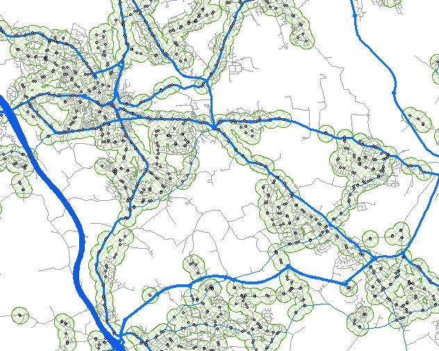
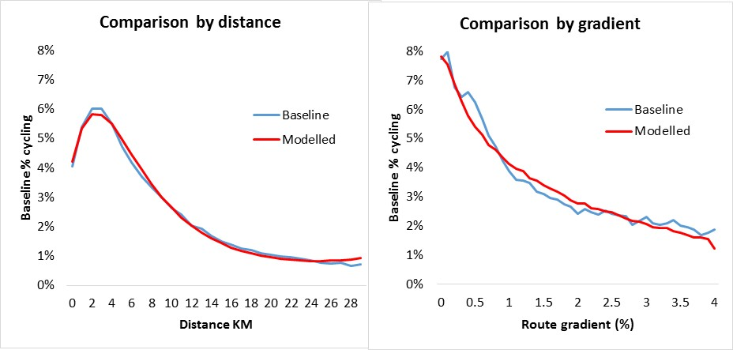
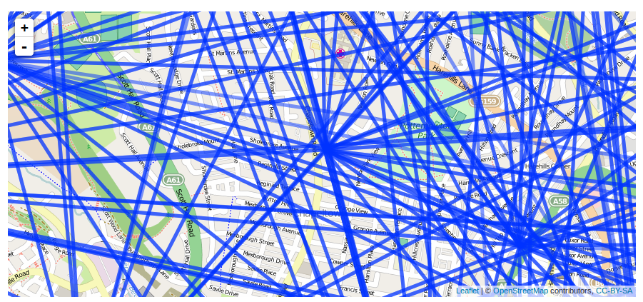
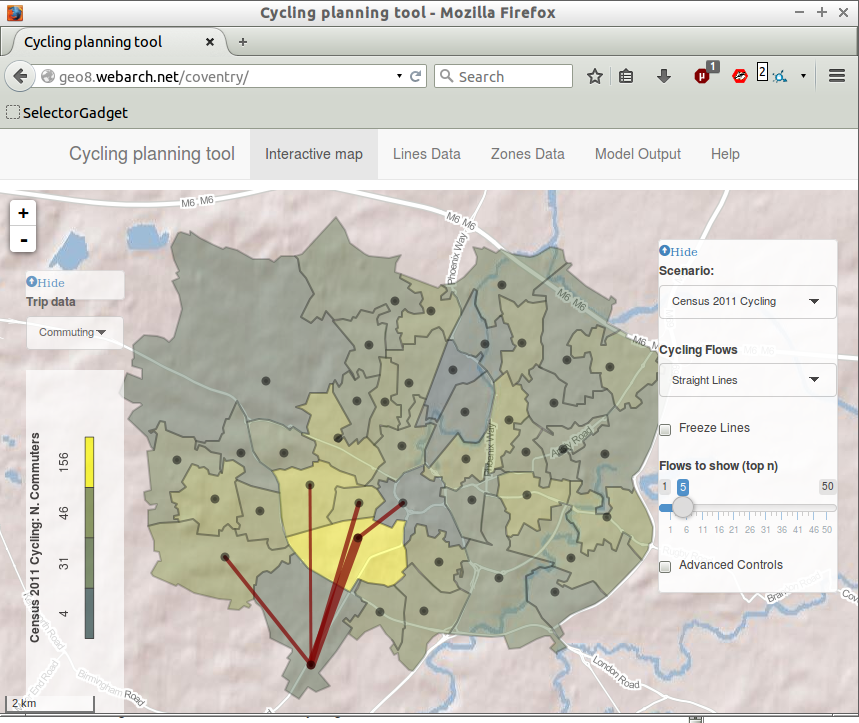
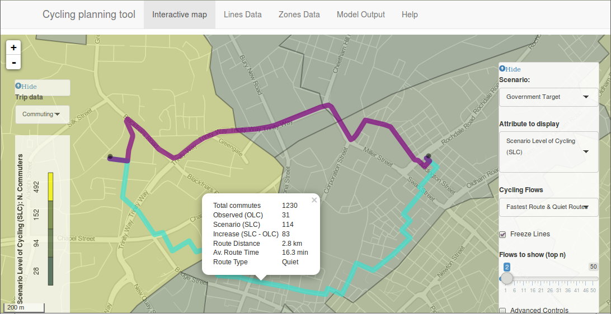
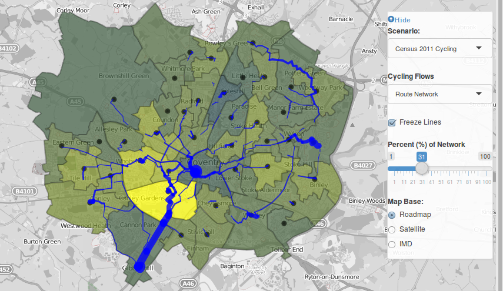
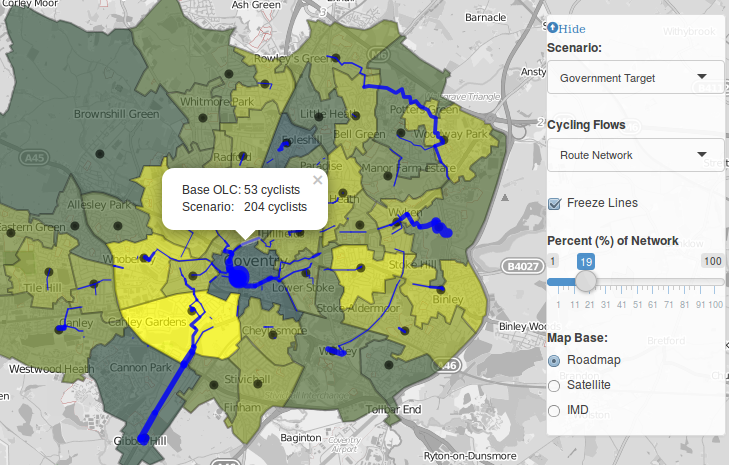
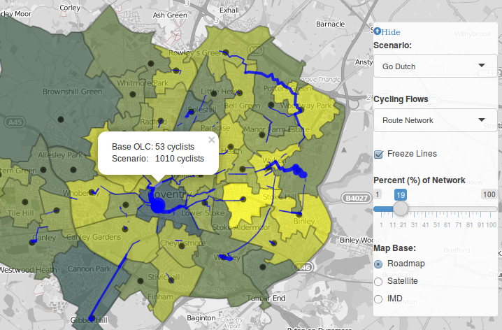

## Contents

> - Recap on accessibility indeces
> - Distance decay
> - Case study: Propensity to Cycle Tool
> - Practical

# Recap on accessibility

## Definition of accessibility

What was accessibility again?

> - Ease with which an individual can access desired services and facilities
> - Different types of accessibility, depending on purpose (education, shopping, etch)
> - By different modes of transport (e.g. cycling)
> - Technical question: at what level does accessibility operate?

Why is it a good sustainability mobility indicator?

> - It incorporates social, economic and environmental factors
> - Provides information at local level for cost-effective interventions

## Example



What are we looking at here? How could it inform policy?

## Access to what? 

Proximity to fast food can be a bad thing ([Burgoine and Monsivais](http://download.springer.com/static/pdf/868/art%253A10.1186%252F1479-5868-10-85.pdf?originUrl=http%3A%2F%2Fijbnpa.biomedcentral.com%2Farticle%2F10.1186%2F1479-5868-10-85&token2=exp=1458091279~acl=%2Fstatic%2Fpdf%2F868%2Fart%25253A10.1186%25252F1479-5868-10-85.pdf), 2015).

- Access to fast food and supermarkets linked with obesity
- Few measures include information about service quality

```{r, echo=FALSE, fig.height=2, fig.width=2}
knitr::include_graphics(rep("../figures/food-exposure.png", 3))
```

# Distance decay

## What is distance decay?

A function that links the proportion of trips to distance:

$$
p = f(d)
$$
See Iacono et al. (2008)

## Why is it important?



## Functional forms of distance decay

See Martinez and Vargas (2013):

- Exponential functions, $e^{\beta x}$ 
- Power functions, $x^{\beta}$ 
- Tanner functions, $x^{\beta_1}e^{\beta_2 x}$ 
- Box-Cox functions, $exp(\beta \frac{x^{\gamma} - 1}{\gamma})$ when the parameter $\gamma \neq 0$ and $x^{\beta}$ when $\gamma = 0$ 

# Case study: Propensity to Cycle Tool

## Input data

```{r, echo=FALSE, fig.cap="Input: A mass of data"}

```

See Lovelace et al. (2016)

## Making the data interactive

```{r, echo=FALSE}

```

## Route allocation - affects access

```{r, echo=FALSE}

```

## Route network analysis



## Accessibility under scenarios of change

See Lovelace et al. (2016)

- Government Target
- Gender Equality
- Go Dutch
- Ebikes

## Scenario shift in network load I



## Scenario shift in network load II




# Practical

## Feedback on R

- How did you find R?
- Anyone used R beyond practical?
- How did it compare with QGIS?

## What you'll need

Download data from here:

https://github.com/ITSLeeds/SSPA


## References

Iacono, Michael, Kevin Krizek, and Ahmed El-Geneidy. 2008. “Access to Destinations: How Close Is Close Enough? Estimating Accurate Distance Decay Functions for Multiple Modes and Different Purposes,” 76.

Lovelace, Robin, Anna Goodman, Rachel Aldred, Nikolai Berkoff, Ali Abbas, and James Woodcock. 2016. “The Propensity to Cycle Tool: An Open Source Online System for Sustainable Transport Planning.” Journal of Transport and Land Use 10 (1). doi:10.5198/jtlu.2016.862.

Martínez, L. Miguel, and José Manuel Viegas. 2013. “A New Approach to Modelling Distance-Decay Functions for Accessibility Assessment in Transport Studies.” Journal of Transport Geography 26: 87–96. doi:10.1016/j.jtrangeo.2012.08.018.

