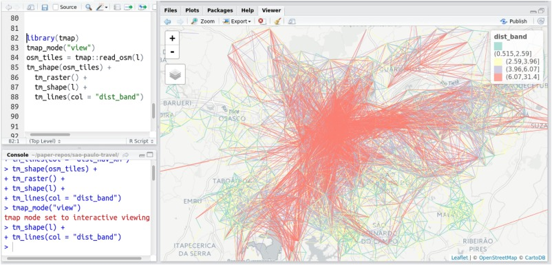

## Contents

> - Recap on accessibility indices
> - Distance decay
> - Case study: Propensity to Cycle Tool
> - Practical

# Recap on accessibility

## Definition of accessibility

What was accessibility again?

> - Ease with which an individual can access desired services and facilities
> - Different types of accessibility, depending on purpose (education, shopping, etch)
> - By different modes of transport (e.g. cycling)
> - Technical question: at what level does accessibility operate?

How do accessibility indicators support sustainability transport policies?

> - It incorporates social, economic and environmental factors
> - Provides information at local level for cost-effective interventions

## Example from previous lecture


What are we looking at here? How could it inform policy?

## Access to what? 

Proximity to fast food can be a bad thing [@burgoine_associations_2014] - see [here](http://download.springer.com/static/pdf/868/art%253A10.1186%252F1479-5868-10-85.pdf?originUrl=http%3A%2F%2Fijbnpa.biomedcentral.com%2Farticle%2F10.1186%2F1479-5868-10-85&token2=exp=1458091279~acl=%2Fstatic%2Fpdf%2F868%2Fart%25253A10.1186%25252F1479-5868-10-85.pdf).

- Access to fast food and supermarkets linked with obesity
- Few measures include information about service quality

```{r, echo=FALSE, fig.height=2, fig.width=2}
knitr::include_graphics(rep("../figures/food-exposure.png", 3))
```

# Distance decay

## What is distance decay?

A function that links the proportion of trips to distance:

$$
p = f(d)
$$
See Iacono et al. (2008)

## Why is it important?

> - Source: The Propensity to Cycle Tool [@lovelace_propensity_2017]


## Functional forms of distance decay

See Martinez and Vargas (2013):

- Exponential functions, $e^{\beta x}$ 
- Power functions, $x^{\beta}$ 
- Tanner functions, $x^{\beta_1}e^{\beta_2 x}$ 
- Box-Cox functions, $exp(\beta \frac{x^{\gamma} - 1}{\gamma})$ when the parameter $\gamma \neq 0$ and $x^{\beta}$ when $\gamma = 0$ 

# Case study: Propensity to Cycle Tool

## Input data

```{r, echo=FALSE, fig.cap="Input: A mass of data"}
knitr::include_graphics("../figures/haystack.png")
```


## Making the data interactive

```{r, echo=FALSE}
knitr::include_graphics("../figures/coventry-centroids.png")
```

## Route allocation - affects access

```{r, echo=FALSE}
knitr::include_graphics("../figures/fast-quiet-man.png")
```

## Route network analysis


## Accessibility under scenarios of change

See [@lovelace_propensity_2017]

- Government Target
- Gender Equality
- Go Dutch
- Ebikes

## Scenario shift in network load I


## Scenario shift in network load II


# Example: school access

## Estimate impacts of school agglomeration

Source paper on [school accessibility](https://www.sciencedirect.com/science/article/pii/S0966692316303453): @moreno-monroy_public_2017

```{r, echo=FALSE}

```

## Estimate cycling potential to school

Source: [paper](https://www.sciencedirect.com/science/article/pii/S2214140518301257) on PCT for schools [@goodman_scenarios_2019]


# Practical Q&A

## Recap on practical and data sources

- Practical guidebook can be found here: https://itsleeds.github.io/QGIS-intro/


There are many good transport datasets out there, but they are not always easy to find.

## Useful data sources

The list below provides links to some key data sources that may be of use and interest, starting with the most universal and easy to use, and ending in rather specific datasets.

- UK geoportal, providing geographic data at many levels: https://geoportal.statistics.gov.uk
- Other national geoportals exist, such as this: http://www.geoportal.org/
- A good source of cleaned origin destination data is the Region downloads tab in the Propensity to Cycle Tool [@lovelace_propensity_2017] - see the Region data tab for West Yorkshire here, for example: http://www.pct.bike/m/?r=west-yorkshire
- OpenStreetMap is an excellent source of geographic data with global coverage. You can download data on specific queries (e.g. highway=cycleway) from the overpass-turbo service: https://overpass-turbo.eu/

## Online lists

For other datasets, search online! Good starting points in your research may be:

- The open data section in Geocomputation with R: https://geocompr.robinlovelace.net/read-write.html#retrieving-data
- Transport datasets mentioned here: https://data.world/datasets/transportation
- UK government transport data: https://ckan.publishing.service.gov.uk/publisher/department-for-transport

## Data packages

- The ors and OSMTools QGIS plugins provide a range of datasets
- The stats19 package can get road crash data for anywhere in Great Britain. See here for info: https://itsleeds.github.io/stats19/
- The pct package provides access to data in the PCT: https://github.com/ITSLeeds/pct
- There are many other QGIS and R packages and plugins to help access data

## References

Iacono, Michael, Kevin Krizek, and Ahmed El-Geneidy. 2008. “Access to Destinations: How Close Is Close Enough? Estimating Accurate Distance Decay Functions for Multiple Modes and Different Purposes,” 76.

Martínez, L. Miguel, and José Manuel Viegas. 2013. “A New Approach to Modelling Distance-Decay Functions for Accessibility Assessment in Transport Studies.” Journal of Transport Geography 26: 87–96. doi:10.1016/j.jtrangeo.2012.08.018.

