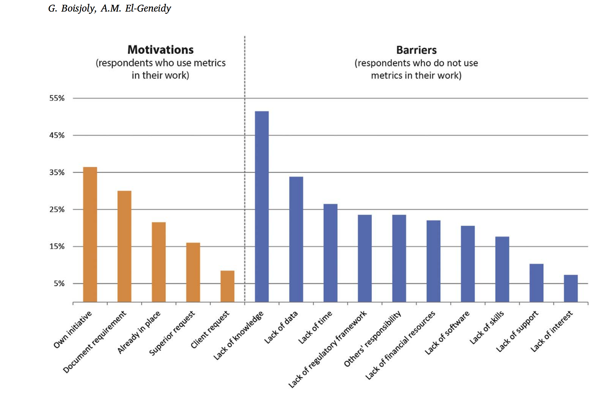

```{r setup, include=FALSE}
knitr::opts_chunk$set(echo = FALSE)
```

## Session outline:

> - Recap on progress with the coursework
> - A quick look at Big Data for SSPA
> - Practical working on your projects
> - (And an opportunity to ask questions)

## Recap on last week

> - Many examples of indicators presented (none right or wrong)
> - Why bother creating indicators?
> - What different types of indicators are there?
> - How can geographic data analysis help?

Key resources:

- Slides by Ian on indicators
- Slides from me - [recap on R](http://rpubs.com/RobinLovelace/380392) [@lovelace_geocomputation_2018]

## Why make indicators?

```{r, out.width="100%"}

```

Source: [@boisjoly_insider_2017]

## Indicators change the world

> - Most indicators emphasise time saving and economic growth, leading to the misled emphasis on motorised modes and speed [@banister_sustainable_2008]

> - Different indicators can lead to different policies.

> - The Propensity to Cycle Tool (PCT) is changing how millions of £ is being invested in cycling, making it more evidence-based [@lovelace_propensity_2017]

## Indicators can be simple | If communicated effectively

See www.pct.bike

```{r, out.width="70%"}
knitr::include_graphics("https://raw.githubusercontent.com/npct/pct-team/master/figures/front-page-leeds-pct-demo.png")
```

## Tip: be skeptical of existing measures

```{r, out.width="40%"}
knitr::include_graphics("https://ars.els-cdn.com/content/image/1-s2.0-S0264275114000134-gr5.jpg")
```

> - How good is this indicator? [source: @mattingly_housing_2014]

## An interactive catch-up on progress

> - Who plans to use QGIS? 
> - Who plans to use R?
> - Who plans to use a bit of both?
> - Study area decisions
> - Indicator aims decided
> - Data access
> - Data analysis started

## Progress with coursework

- Gantt charts are useful!

```{r, fig.show='hold', out.width="70%"}
knitr::include_graphics(c("https://pbs.twimg.com/media/CoXTMBlUEAAdRhk.jpg", "https://pbs.twimg.com/media/DYZ61kzWAAExNUv.jpg"))
```

Source: Dean [Attali](https://twitter.com/daattali/status/758244785534570496) and Robin [Lovelace](https://twitter.com/robinlovelace/status/974602687160336386)

## A bit on Big Data

- But first 5 commandments of Big Data [see @lovelace_big_2016]:

> 1) thou shalt remember the purpose of thine research regardless of the size of thine dataset
> 2) thou shalt not spend excessive amounts of time making visualising big data for the sake of it (or social media clickbait)
> 3) thou shalt not do big data until thou has done 'small data' first
> 4) thou shalt not hide thine ideas behind complex terminology associated with the terms 'big data' or 'data science', the meaning of which has not been clearly identified.
> 5) if thou wants to be a data scientist thou must program ... "for documentation, sharing and scientific repeatability" ([mount 2016](http://www.r-bloggers.com/some-programming-language-theory-in-r/)).

## Next steps: 

> - Another commandment: do not get distracted by Big Data
> - High priority: crack-on 
with the coursework
> - check-out the big data and big data archives slides
> - CRACK-ON with the coursework!
> - I'll present on Big Data in due course...

## References {.smaller}
