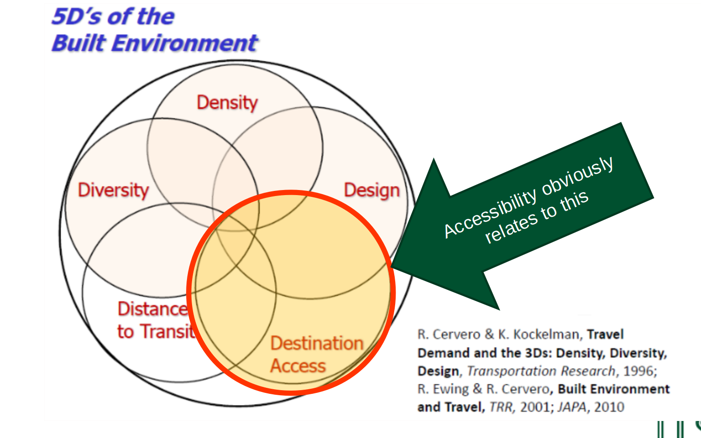
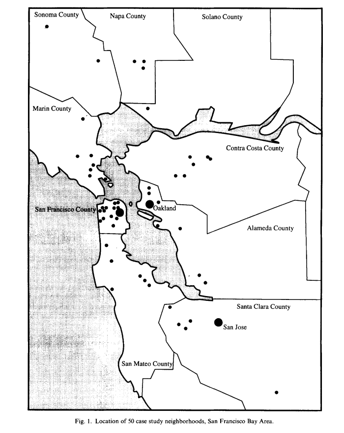

# Outline

## Contents

> - Recap + context
> - The PCT
> - The CyIPT
> - Live demo
> - Next steps

# Recap + context

## The scale of the challenge, from this...

```{r, echo=FALSE, out.width="50%", fig.cap="Source: [Brent Toderian](https://twitter.com/BrentToderian)"}
knitr::include_graphics("https://pbs.twimg.com/media/DOH94nXUIAAgcll.jpg")
```

## Towards cycling being the natural choice

```{r, echo=FALSE, out.width="70%", fig.cap="Source: [Brent Toderian](https://twitter.com/BrentToderian)"}
knitr::include_graphics("https://pbs.twimg.com/media/DJaWCo0U8AAzQGW.jpg:large")
```

## Spheres of influence

```{r, echo=FALSE}

```


## Problem: lack of data

```{r, echo=FALSE}

```


## Problem: evidence overload

```{r, echo=FALSE, out.width="80%"}
knitr::include_graphics("https://larrycuban.files.wordpress.com/2015/02/data-overload-2.jpg")
```

## Consequences of 'evidence overload'

> - Problem is operationalising this data [@lovelace_propensity_2017]
> - Needs to be provided in a format that can be acted on at the local level. Not like http://citydashboard.org/london/
> - Requires a diverse team

# The PCT

## Background | Collaborative working

- Robin Lovelace (Lead Developer, University of Leeds)
- James Woodcock (Principal Investigator, Cambridge University)
- Anna Goodman (Lead Data Analyst, LSHTM)
- Rachel Aldred (Implementation Lead, Westminster University)
- Ali Abbas (User Interface, University of Cambridge)
- Alvaro Ullrich (Data Management, University of Cambridge)
- Nikolai Berkoff (System Architecture, Independent Developer)
- Malcolm Morgan (GIS and infrastructure expert, UoL)

## Historical (personal) context
> - These tools have been 3+ years in the making
> - Origins go back further
```
Concept (PhD) -> Job at UoL (2009 - 2013)
 Discovery of R programming and shiny (2013)
  Link-up with Cambridge University and colleagues (2015)
    Implementation on national OD dataset, 700k routes (2016)
      Completed LSOA phase (4 million lines!) (2017)
        PCT Wales commissioned + CyIPT Phase III (2018)
```
> - Internationalisation (2019?)

## Academic context (source: Lovelace et al. 2017)
```{r, echo=FALSE, message=FALSE}
dft = readr::read_csv("https://github.com/npct/pct-team/raw/master/data-sources/cycle-tools-wide.csv")
dft$Tool = gsub("Permeability Assessment Tool", "PAT", dft$Tool)
knitr::kable(dft[-5, ])
```
 
## National policy context - see [w](http://npct0.vs.mythic-beasts.com/shiny_interface/?r=west-yorkshire)[ww.pct.bike](www.pct.bike)

Cycling and Walking Infrastructure Strategy (CWIS): to 'double cycling'

```{r, echo=FALSE, out.width="80%"}
knitr::include_graphics("https://raw.githubusercontent.com/npct/pct-team/master/figures/front-page-leeds-pct-demo.png")
```

## The international dimension

```{r, out.width="70%", fig.cap="~200 km cycle network in Seville, Spain. Source: WHO report at [ATFutures/who](https://github.com/ATFutures/who)", echo=FALSE}
knitr::include_graphics("https://raw.githubusercontent.com/ATFutures/who/master/fig/sevnet2.png")
```

> - Not a UK-specific issue, but benefits of country-specific tools

## What can the PCT do? - see [w](http://npct0.vs.mythic-beasts.com/shiny_interface/?r=west-yorkshire)[ww.pct.bike](www.pct.bike)

```{r, echo=FALSE, fig.cap="The front page of the open source, open access Propensity to Cycle Tool (PCT).", out.width="80%"}
knitr::include_graphics("https://raw.githubusercontent.com/npct/pct-team/master/figures/pct-frontpage.png")
```

## Policy feedback

"The PCT is a brilliant example of using Big Data to better plan infrastructure investment. It will allow us to have more confidence that new schemes are built in places and along travel corridors where there is high latent demand."

- Shane Snow: Head of Seamless Travel Team, Sustainable and Acessible Travel Division

"The PCT shows the country’s great potential to get on their bikes, highlights the areas of highest possible growth and will be a useful innovation for local authorities to get the greatest bang for their buck from cycling investments and realise cycling potential."

- Andrew Jones, Parliamentary Under Secretary of State for Transport

# The Cycling Infrastructure Prioritisation Toolkit (CyIPT)

## Tookit design

```{r, echo=FALSE, out.width="100%"}
knitr::include_graphics("https://raw.githubusercontent.com/cyipt/cyipt/master/figures/schematic-flow-diagram.png")
```

## Data on infrastructure-uptake at a regional level

- Clear link between infrastructure and uptake

```{r, echo=FALSE, out.width="70%"}
knitr::include_graphics("https://raw.githubusercontent.com/cyipt/cyipt-website/master/images/ttwa-uptake.png")
```

## New datasets:

> - DfT's Transport Direct data
> - 2001 OD data (manipulated and joined with 2011 data)


## Operationalising the data

See: https://www.cyipt.bike (password protected)

```{r, echo=FALSE, fig.show='hold', out.width="50%"}
knitr::include_graphics(c("../../cyipt-website/images/infrastructure/large/lightsegregation.jpg", "../../cyipt-website/images/recommended.png"))
```

# Live demo

- See http://www.pct.bike/
- And https://www.cyipt.bike

## Set-up

The purpose of this session is to get you more familiar with the PCT and the CyIPT in some real world scnearios. 

- Divide into teams of 3-4 people and select and an area to study.  We suggest you choose a large city and surroundings (see English regions on http://www.pct.bike/ for ideas).  
- Ensure that at least 1 person in each group has a laptop.

## Assessing cycling potential with the PCT

- Using the interactive interface answer:
- What’s the current level of cycling in the study region?
- Which part of the region has the highest level of cycling?
- Which routes have the highest level of cycling to work (hint: use the Route Network (LSOA) option from the Cycling Flows dropdown menu)?
- Does those routes have infrastructure already? (hint: use the cycle map base map or jump-ahead to use the CyIPT)
- Where are cycling levels projected to grow most? Is it where there is already the highest levels of cycling? 
- In broad terms what are the implications for cycling uptake? (we’ll go into the detail with the CyIPT).

## Explore the CyIPT Evidence and Recommendations (15 Minutes)

- Now go onto the CyIPT site https://www.cyipt.bike/ and search for or navigate to the area of interest. Start by looking at the existing infrastructure but look at all these layers:
- Existing Infrastructure – Cycle Infrastructure - is there a cohesive network? Where are the holes?
- Existing Infrastructure -  Speed Limits - are they conducive to cycling (30 mph+ is negatively associated with cycling)
- Traffic Counts - are there quiet streets along routes of high potential
- Crash data - does it seem there are areas in particular need of remediation for safety reasons?

# Next steps: How to use open tools for planning

## Using open source software

- Online interfaces reduce barriers
- But there are benefits of running analysis locally
- Various software options, including:

> - QGIS mapping software
> - sDNA QGIS plugin
> - Key feature of CyIPT and PCT:
> - Open source and provides open data downloads
## Next steps

> - Take a look at the data provided at www.pct.bike: can it provide useful insight into areas you're looking?
> - In terms of policy: how can you use data to show not only what is, but what could be?
> - Creating an active transport toolkit for cities internationally
> - Must be based on local needs

## Links + references

- The PCT in action: http://www.pct.bike/
- A prototype of the CyIPT: http://cyipt.bike/
- Resource on R for transport: http://geocompr.robinlovelace.net/transport.html